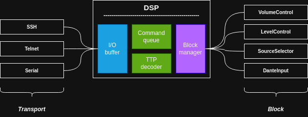

# PyTesira
Control your Biamp Tesira DSPs directly from Python!

*work in progress!* stuff might break, please don't rely on this for anything critical... yet

> Obligatory disclaimer: this is an unofficial project which is not in any way affiliated with, or endorsed by, Biamp Systems

## Architecture
PyTesira adopts a modular design where the `DSP` class (`src/pytesira/dsp.py`) acts as the hub for everything.



A `Transport` channel (such as `SSH`) is used for connection to the Tesira DSP device (using the Tesira Text Protocol). 
Currently, `SSH` is the only supported transport (other transports are planned - feel free to submit a pull request also!).

Upon connection, PyTesira tries to create a *block map* of available DSP blocks. For each supported block type, it also
attempts to query that block's *attributes* (e.g., number of channels and their labels). This can be exported and re-imported
to shorten startup time (querying is slow - especially on a complex setup with many nodes).

A `Block` represents a type of DSP block available (e.g., `LevelControl` or `SourceSelector`). It handles everything that
has to do with that specific DSP block - setting up subscriptions, updating state, handling update requests, and more.

## Supported blocks and features

* `LevelControl`   : read/write mute status, read/write levels
* `MuteControl`    : read/write mute status
* `SourceSelector` : read/write mute status (output), set source and output levels, read levels, read and select active source
* `DanteInput`     : read/write mute status, read/write levels, read/write invert setting, read/write fault-on-inactive setting
* `DanteOutput`    : read/write mute status, read/write levels, read/write invert setting, read/write fault-on-inactive setting

## Tested on

* TesiraFORTÉ DAN (software version `4.11.1.2`)

## Simple usage example
```py
from pytesira.dsp import DSP
from pytesira.transport.ssh import SSH

device = DSP()
device.connect(backend = SSH(
                        hostname = "tesira.device.lan",
                        username = "admin", 
                        password = "forgetme",
                        host_key_check = False # Bad option! Bad! Change this in production!
                ))

# Note: at this point, we need to wait for the DSP to be fully connected/ready. 
# To do so, we can simply check for the boolean flag `device.ready`
while not device.ready:
    pass

# Save block map, which can then be loaded by specifying `block_map`
# next time when we load the class like so: DSP(block_map = "dsp_test.bmap")
device.save_block_map(output = "dsp_test.bmap")

# Get system info
print(device.hostname)
print(device.serial_number)
print(device.software_version)

# Get faults and network status
print(device.faults)
print(device.network)

# Assuming a 2-channel level control block named `LevelTest`,
# we first look at its channel status
print(device.blocks["LevelTest"].channels)

# Change level and mute states of a LevelControl block
device.blocks["LevelTest"].set_level(channel = 1, value = -20.0)
device.blocks["LevelTest"].set_mute(channel = 2, value = True)

# Get information on a source selector block named `SourceTest`
# (this includes all channels and their levels, as well as currently selected source)
print(device.blocks["SourceTest"].sources)

# Set source on a selector
device.blocks["SourceTest"].select_source(source = 1)

# Set source level on a selector
device.blocks["SourceTest"].set_source_level(source = 1, value = 0.0)
```